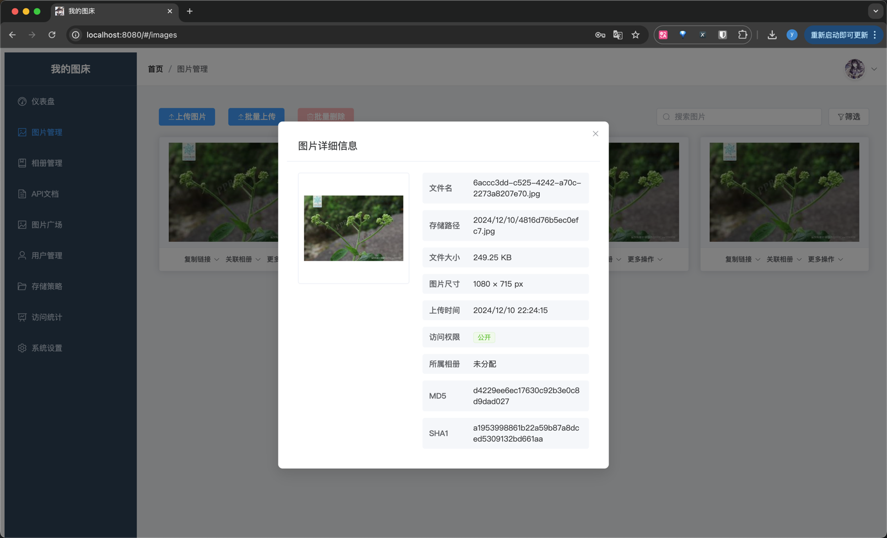

# 基于兰空图床 API 重写的图床服务

这是根据 [兰空图床](https://github.com/lsky-org/lsky-pro) API
重写的图床服务，实现了与兰空图床在 [API](https://github.com/lsky-org/lsky-pro/blob/911275c13b038c7a8b710de44664f23887eeb6f6/resources/views/common/api.blade.php#L9)
上相同的功能，同时 100% 兼容了 Halo 博客的 [Lsky Pro 插件](https://github.com/ichenhe/halo-lsky-pro#readme)。

你可以根据 `Dockerfile` 快速启动一个图床服务。

 需要Mysql环境

## 写在前面

写这个图床的主要原因有两点：

1. **内网与公网地址问题**：我的图床服务配置在内网主机上，通过端口转发到公网服务器，配置了 CDN，并启用了
   HTTPS。然而由于某种验证机制，导致在内网初始化的兰空图床返回的图片 URL 全是内网的地址，而如果使用外网域名则根本无法完成初始化。
2. **CDN 鉴权与防盗链**：为了实现 CDN 鉴权，防止图像盗链，我需要在图片 URL 后面加上一个临时访问的 token。这个功能配合上 Halo
   的密码阅读保护插件，能够减少图片被盗用的风险。即没有阅读完整博文的权限的情况下，也无法从 CDN 访问图片。

## 注意

1. **HTTPS 配置**：如果博客使用了 HTTPS，则图床也需要使用 HTTPS，否则浏览器会在前端拦截。
2. **域名配置**：请在配置文件中配置博客的服务器域名地址，否则无法使用。域名地址类似于这样：`https://static.blogdomain.com`
3. **挂载磁盘**： 在容器启动时，挂载一个磁盘到 `/app` 目录，用于存储图片。如果不挂载磁盘，存储的图片会在容器关闭时丢失。

## 启动方法

### 使用 Docker Compose（推荐）

参照 docker-compose.yml，配置必要的环境变量后启动容器：

    docker-compose up -d

## 完成功能

    ✔ 基本的API功能(Token、上传、下载、相册、删除)
    ✔ 多存储策略(已实现本地存储和腾讯云COS) 基于[X File Storage](https://github.com/dromara/x-file-storage)
    ✔ 权限管理
    ✔ 多用户
    ✔ 初始化界面
    ✔ Lsky Pro API兼容
    ✔ 缩略图
    ✔ Refer防盗链
    ✔ Web界面及管理功能

## 下一步计划功能

     [ ] 图片水印
     [ ] 多种鉴权方式
     [ ] 2FA登陆认证
     [ ] 优化Refer防盗链
     [ ] 图片审核功能

## Gradle操作
  `gradle clean` 清理生成
  `gradle bootRun` 直接运行
  `gradle npmDev` 前端Dev模式
  `gradle frontendBuild` 前端打包
  `gradle build` 打包(自动将前端文件打包到jar中) 位置在 bed-web/build/libs/bed-web-0.0.1-SNAPSHOT.jar

## 预览

防盗链服务需要在Halo上进行额外的插件开发，让每次发出图片请求时都带上token，这个功能暂时没有实现。正在研究halo插件开发中。

## 感谢

感谢[兰空图床](https://github.com/lsky-org/lsky-pro)
感谢[halo-lsky-pro]( https://github.com/ichenhe/halo-lsky-pro)
感谢[X File Storage](https://github.com/dromara/x-file-storage) 
感谢Cursor 和 Github Copilot的代码生成